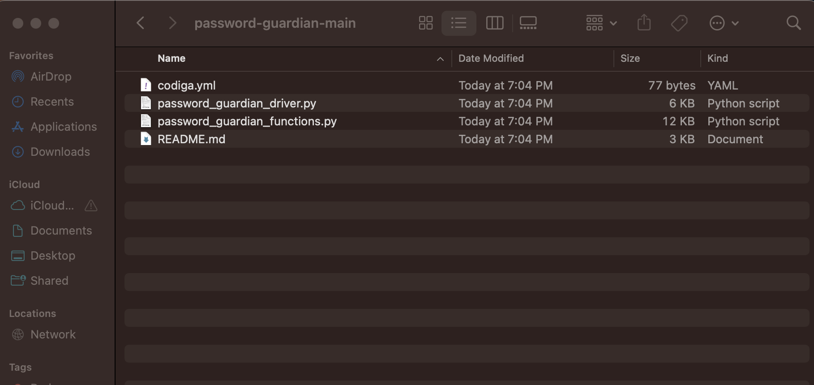
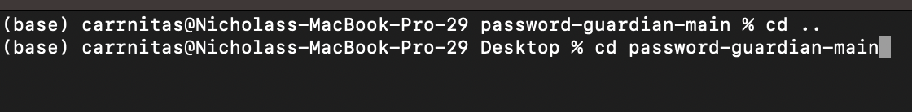
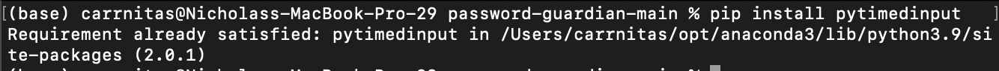

# Set Up

Download the zip file from [here](https://github.com/Guardians-of-the-Software-Galaxy/password-guardian).

 

The downloaded zip file will need to be decompressed

 

Now the file contents are visible, notice that there is no data.txt file or filekey.key file. These files are generated upon creation of a password guardian instance.

 

From there cd into the directory

 

Finally run **pip install pytimedinput**

 

The application is now ready for use!

# Create a Password Guardian Credential

